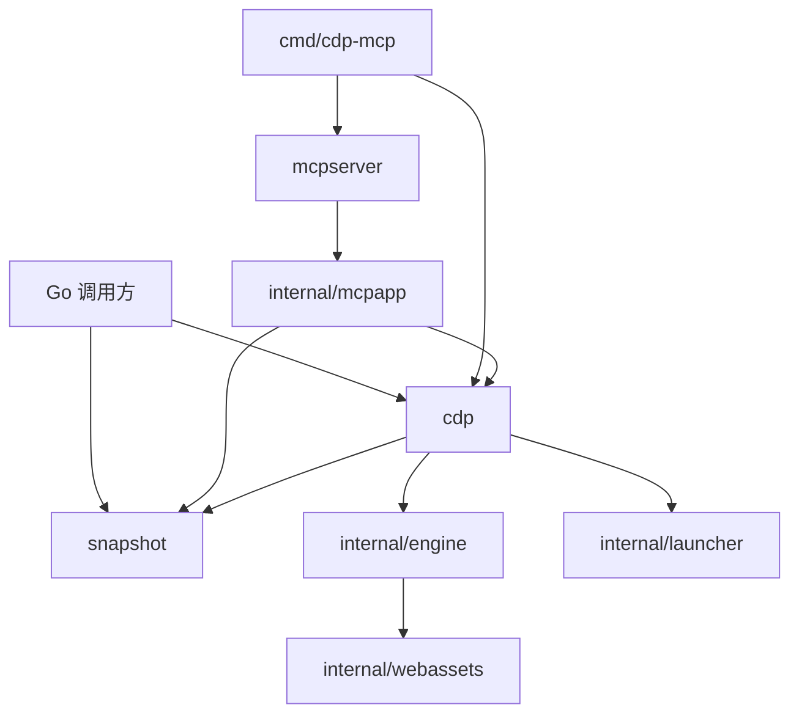

# 项目架构

项目在单个 Go module 中提供浏览器自动化库和 MCP HTTP 服务。使用方式见 [README](../README.md)，修改与验证流程见 [开发指南](development.md)。

## 包边界

| 位置 | 职责 |
| --- | --- |
| 根包 `cdp` | 面向调用方的浏览器、页面、定位、资源管理与错误契约 |
| `snapshot/` | 快照数据模型与纯渲染、搜索、差异比较 |
| `mcpserver/`、`cmd/cdp-mcp/` | 可嵌入 HTTP 服务与独立命令入口 |
| `internal/engine/` | CDP 连接、target 生命周期、执行上下文与页面操作 |
| `internal/launcher/` | 浏览器发现、进程与 profile 管理 |
| `internal/webassets/` | 页面侧 TypeScript 和嵌入 Go 的 JavaScript 产物 |
| `internal/mcpapp/` | MCP 工具、标签页、快照引用与交互状态 |
| `internal/cmd/bindgen/` | Go/TypeScript binding 生成器 |
| `examples/`、`e2e/` | 公开 API 示例与真实浏览器验证 |

公开包签名使用公共类型。MCP 通过公开 `cdp` API 操作浏览器；根库与 `snapshot` 的包依赖独立于 MCP SDK。内部工具按实际共享职责组织。

## 生命周期与调用链

根包负责资源所有权、超时和公开错误契约，engine 负责 CDP 协议与运行时状态。MCP 复用公开库能力，维护自己的工具和快照引用状态。资源释放约定见 [Go API 指南](library-api.md)。

`BrowserManager` 集中管理 binding、初始化脚本与 target 生命周期，通过 frame tree 和导航事件建立运行时，不依赖 Runtime 诊断事件。只有完成初始化的 Page 才对外发布；文档与执行上下文的代际用于隔离导航前后的状态。

Go 构造定位计划，页面侧 TypeScript 统一解析并执行。查询、快照与命中检测共享 author Shadow DOM 的访问能力。Locator 表达可重复查询，Element 表达精确节点；浏览器侧失败通过结构化错误链返回。

## 页面运行时

| 执行环境 | 用途 |
| --- | --- |
| Page main | 用户默认 Eval 的页面环境 |
| Main runtime | 按需启用 fullscreen、print 等页面可感知能力 |
| Isolated core | 选择器、可操作性、快照、截图与绘制 |
| Overlay | CDP Overlay 协议，不对应 JavaScript execution context |

Isolated core 通过 `CdpFFI` 统一提供功能并管理内部模块生命周期。Go 根据操作选择执行上下文；main world 控制器使用随机名称的全局词法绑定。

跨 iframe 的查询、坐标、截图和可操作性诊断共享认证加密的 frame bridge。密钥只注入 isolated world，消息交付绑定当前接收文档；frame 身份来自 CDP，避免信任网页自报的身份。

页面脚本构建为 `core`、`main_runtime` 两个入口，随 Go 模块嵌入。开发者修改 TypeScript 或 binding 源时同步生成产物，Go 使用方无需安装前端构建工具。

## 信任边界

网页与注入运行时共享 DOM，但不能凭网页消息调用内部 bridge。HTTP 层分别保护 MCP 与 Debug 的跨站请求，Debug 的读取和 WebSocket 也执行来源校验；MCP CORS 授权仅作用于 MCP，访问认证由部署方管理。

这些隔离保护内部控制与消息完整性。页面仍能观察 DOM 变化、交互和消息流量；全屏、打印等页面可感知能力也有可观察行为，因此项目不承诺浏览器自动化完全不可检测。
